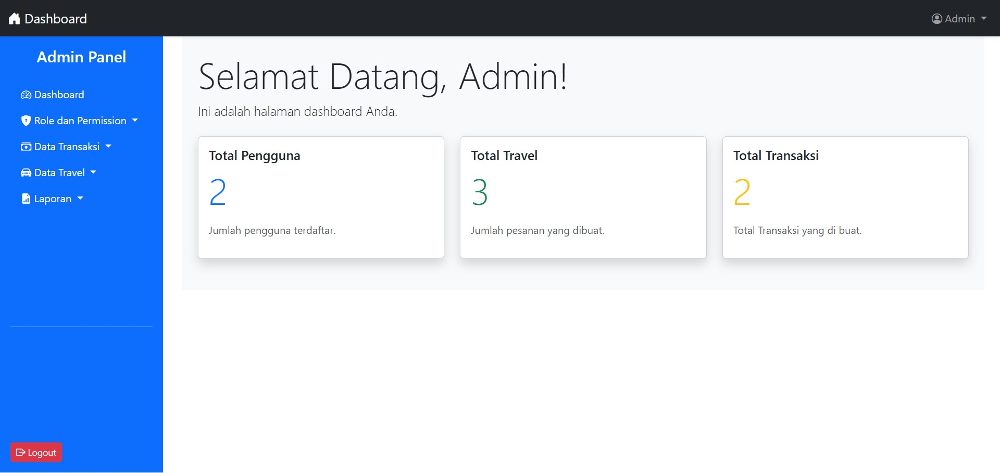

# Travel Online

ini adalah Aplikasi Pemesan Travel secara online, yang di buat oleh Muhamad Widyantoro sebagai Bentuk Test Programing.

## 🌐 Demo

Kunjungi aplikasi Travel Online di:

-   **Web Travel:** [Travel Online](https://travel-online.latihanserver.my.id)
-   **Login sebagai Admin:**
    -   **Email:** admin@admin.com
    -   **Password:** admin
-   **Login sebagai User:**
    -   **Email:** user@user.com
    -   **Password:** user

---

## 🛠 Teknologi yang Digunakan

-   **Laravel** - Framework Laravel
-   **MySQL** - Database untuk menyimpan data
-   **Tailwind CSS** - Untuk tampilan yang responsif
-   **Laravel UI** - Untuk sistem login yang aman
-   **DOMPDF** - Untuk Melakukan Cetak PDF

## 🚀 Fitur Utama

-   ✅ Manajemen pengguna dengan autentikasi
-   ✅ Manajemen Role dan Permission
-   ✅ Manajemen Jadwal Travel
-   ✅ Sistem Pesan Travel
-   ✅ Sistem Pembayaran
-   ✅ Sistem Riwayat Pemesanan
-   ✅ Responsif dan Ramah Pengguna untuk Frontend
-   ✅ Filter Pencarian dan Pemilihan Jadwal Travel

## 📥 Cara Instalasi

Pastikan Anda sudah menginstal **PHP, Composer, dan MySQL** di sistem Anda.

1. **Clone Repository**
    ```bash
    git clone git@github.com:widyantoroofficial/LARAVEL-APLIKASI-PESAN-TRAVEL-ONLINE.git
    cd LARAVEL-APLIKASI-PESAN-TRAVEL-ONLINE
    ```
2. **Install Composer**
    ```bash
    https://getcomposer.org/Composer-Setup.exe
    ```
3. **Install Dependencies**
    ```bash
    composer update
    ```
4. **Buat File .env**
    ```bash
    cp .env.example .env
    ```
5. **Konfigurasi Database**
    - Buka `.env` dan atur `DB_DATABASE`, `DB_USERNAME`, dan `DB_PASSWORD`
6. **Generate Key & Migrasi Database**
    ```bash
    php artisan key:generate
    ```
7. **Migrasi Database & Data Seeder**
    ```bash
    php artisan migrate:fresh --seed
    ```
8. **Jalankan Aplikasi**
    ```bash
    php artisan serve
    ```
    Akses aplikasi di `http://127.0.0.1:8000`

## 🖼 Screenshots

_Tambahkan screenshot aplikasi di sini untuk memperjelas tampilan fitur._

### Tampilan Halaman Frontend(User)


### Tampilan Halaman Backend(Admin)



---

### 📌 Catatan

-   Akun admin dan user telah disediakan dalam seeder

💡 **Dikembangkan oleh:** _Muhamad Widyantoro_  
📧 **Kontak:** *muhamadwidyantoro@gmail.com*
